# ⚡ Awesome Real User Monitoring (RUM)

  
  
  
  
  
  
  

  

## 🌐 Curated Real User Monitoring (RUM) & Frontend Observability Ecosystem

> A production-grade curated list of top **SaaS platforms** and **open-source libraries** for **Real User Monitoring (RUM)**, **Frontend Observability**, **Core Web Vitals (LCP, INP, CLS)**, **Session Replay**, **JavaScript Error Diagnostics**, and **Full-Stack Telemetry Correlation**.  
> **Last updated: September 2026**

Real User Monitoring (RUM) captures performance, network latency, browser errors, and behavioral session data directly from real users' client browsers and devices. Unlike synthetic monitoring run from predictable cloud data centers, RUM uncovers the actual, real-world user experience across varied networks, mobile devices, ISP routing, and client runtimes.

---

### 📑 Table of Contents
- [📊 Market Overview & Industry Dynamics](#-market-overview--industry-dynamics)
- [🏢 SaaS & Hosted Commercial Platforms](#-saas--hosted-commercial-platforms)
- [💻 Open-Source GitHub Projects](#-open-source-github-projects)
- [🔍 Key Metrics & Core Web Vitals Cheat Sheet](#-key-metrics--core-web-vitals-cheat-sheet)
- [🤝 How to Contribute](#-how-to-contribute)
- [📈 Star History](#-star-history)
- [⚖️ Disclaimer & Privacy Standards](#️-disclaimer--privacy-standards)

---

## 📊 Market Overview & Industry Dynamics

> 📊 **Market Sizing & Growth**: The global End-User Experience Monitoring (EUEM) and Real User Monitoring (RUM) market is valued at **~$3.9B to $5.0B in 2025–2026** and is projected to expand to **$9.1B+ by 2030**, advancing at a Compound Annual Growth Rate (CAGR) of **~15.7%** (with mobile and single-page app RUM expanding at over 17%).  
> 🏛️ **Sector Concentration**: The sector is **moderately fragmented to consolidating / oligopolistic**—hyperscalers and APM giants (Microsoft, Cisco AppDynamics, IBM, Datadog, Dynatrace) capture large enterprise budgets by bundling RUM into unified observability suites, while specialized frontend innovators (Sentry, LogRocket, SpeedCurve, Raygun) retain durable market defensibility through deep session replays, Core Web Vitals optimization, and developer-first workflows.

---

## 🏢 SaaS & Hosted Commercial Platforms

*Sorted in descending order by parent company scale (Market Capitalization / Valuation / Annual Revenue).*

| 🏢 Platform | 💰 Company Valuation / Revenue (Size) | 🎯 Core Features & Focus | 🏷️ Starting Pricing | 🎁 Free Tier / Free Trial Limits |
| :--- | :--- | :--- | :--- | :--- |
| **[Azure Application Insights](https://azure.microsoft.com/products/monitor/)** | **~$3.1 Trillion Market Cap** *(Microsoft, ~$245B Ann. Rev)* | Cloud-native APM with browser JavaScript SDK for page views, user timings, AJAX calls, and end-to-end distributed tracing. | **$0/month** for first 5 GB; pay-as-you-go data ingestion starts at **$2.30 / GB** (Analytics Logs, East US) with 90 days retention included | **Free Forever Plan**: **5 GB/month** data ingestion free per billing account with 90 days retention; plus Azure Free Account provides $200 credits for 30 days |
| **[Cisco AppDynamics Browser RUM](https://www.appdynamics.com/product/end-user-monitoring/browser-monitoring)** | **~$230 Billion Market Cap** *(Cisco, ~$54B Ann. Rev)* | Enterprise browser monitoring tracking page rendering, AJAX requests, JavaScript errors, and business transaction correlation to backend APM. | Starts at **$0.06 per 1,000 RUM tokens/month** (1 pageview = 1 token, billed annually); core APM with RUM starts at **$60 / CPU core/month** | **15-day free trial** (extendable up to 30 days) with full access to Browser RUM, APM, and analytics across all agents (no credit card required) |
| **[IBM Instana](https://www.ibm.com/products/instana)** | **~$210 Billion Market Cap** *(IBM, ~$62B Ann. Rev)* | Automated real-time website monitoring (EUM), page performance, JS errors, and 1-second metric resolution linked to microservice traces. | Essentials starts at **$21 / host (MVS)/month** ($0.03/hr pay-per-use); Standard tier (full APM + EUM) starts at **$75 / host (MVS)/month** ($0.12/hr) | **14-day free trial** with unrestricted access to website monitoring, distributed tracing, and APM (no credit card required) + 2-minute sandbox demo |
| **[Datadog RUM](https://www.datadoghq.com/product/real-user-monitoring/)** | **~$42 Billion Market Cap** *(Datadog, ~$2.7B Ann. Rev)* | Full-featured real user monitoring integrated with APM, logs, Core Web Vitals, and session replay for end-to-end troubleshooting. | Starts at **$1.50 / 1,000 sessions/month** (annual) or $2.20/1k on-demand ($0.15/1k for RUM Measure; Session Replay add-on starts at $2.50/1k sessions) | **14-day free trial** with full platform access (all RUM features, APM, and logs; no credit card required) |
| **[Cloudflare Web Analytics](https://www.cloudflare.com/web-analytics/)** | **~$35 Billion Market Cap** *(Cloudflare, ~$1.7B Ann. Rev)* | Lightweight, privacy-first real user monitoring without cookies, tracking Core Web Vitals (LCP, INP, CLS) and page load timings from Cloudflare edge. | **100% Free** ($0/month with no paid tier required) | **Free Forever Plan with Unlimited Usage**: Unlimited pageviews and sessions across unlimited sites for any Cloudflare account (no volume cap or credit card needed) |
| **[Dynatrace RUM](https://www.dynatrace.com/platform/real-user-monitoring/)** | **~$16 Billion Market Cap** *(Dynatrace, ~$1.5B Ann. Rev)* | AI-powered real user monitoring with Davis AI root-cause analysis, automatic dependency mapping, and user experience analytics. | Starts at **$0.00225 / session** ($2.25 per 1,000 sessions); **$0.0045 / session** ($4.50 per 1,000 sessions) including Session Replay under DPS model | **15-day free trial** with full platform access to RUM, APM, and Davis AI engine (no credit card required) + live sandbox playground |
| **[Elastic RUM](https://www.elastic.co/observability)** | **~$10 Billion Market Cap** *(Elastic N.V., ~$1.4B Ann. Rev)* | Frontend performance and error telemetry ingested into the Elastic Stack for Elasticsearch querying, Kibana dashboards, and full APM correlation. | Serverless starts at **$0.09 / GB ingested** + **$0.019 / GB retained/month**; hosted Elastic Cloud clusters start at **$95 / month** (Standard tier) | **14-day free trial** on Elastic Cloud with full access to Elastic Observability features and up to $300 in usage credits (no credit card required) |
| **[New Relic Browser](https://newrelic.com/platform/browser-monitoring)** | **~$6.5 Billion Valuation** *(TPG & Francisco Partners; ~$1B Rev)* | Browser and frontend monitoring with NRQL querying, Core Web Vitals, session insights, and correlation to backend distributed traces. | **$0/month** (included in free tier); overages beyond 100 GB start at **$0.40 / GB** data ingested (Standard) + $49/user/mo for additional Core users | **Free Forever Plan**: **100 GB/month** data ingest across all telemetry (shared across RUM, APM, and logs), 1 Full Platform user, unlimited basic users, 8+ days retention |
| **[Grafana Cloud Frontend Observability](https://grafana.com/products/cloud/frontend-observability/)** | **~$6.0 Billion Valuation** *(Grafana Labs Series D; ~$200M+ ARR)* | Managed frontend monitoring built on the open-source Grafana Faro SDK, tightly integrated with Grafana, Loki, Tempo, and Mimir (LGTM). | **$0/month** for up to 50k sessions; Pro plan starts at **$19 / month** base fee + **$0.75 per 1,000 sessions** beyond free limits | **Free Forever Plan**: **50,000 sessions/month** for Frontend Observability, 10k series metrics, 50 GB logs, 50 GB traces, 3 users, and 14-day data retention |
| **[Sentry (Performance & Replay)](https://sentry.io/)** | **~$3.0+ Billion Valuation** *(Functional Software Series E; ~$100M+ ARR)* | Error tracking and frontend performance monitoring, Core Web Vitals, distributed tracing across spans, and session replay. | Developer tier is **$0/month**; Team plan starts at **$26 / month** (billed annually) or $29/mo (monthly); Business starts at $80/mo (annual) | **Free Forever Plan (Developer)**: **10,000 performance spans/month**, **50 session replays/month**, **5,000 errors/month**, 1 GB attachments for 1 user; **14-day free trial** for Business tier |
| **[SolarWinds Pingdom](https://www.pingdom.com/)** | **~$2.1 Billion Market Cap** *(SolarWinds, ~$780M Ann. Rev)* | Real user monitoring paired with synthetic uptime and transaction checks, measuring load times, geographies, and browser platforms. | Starts at **$18 / month** for 100,000 RUM pageviews/month (billed annually, or $19.50/mo monthly) | **30-day free trial** with full access to Real User Monitoring and Synthetic Monitoring (no credit card required) |
| **[SmartBear AlertSite](https://smartbear.com/product/alertsite/)** | **~$1.5 Billion Valuation** *(Vista Equity & Francisco Partners; ~$200M+ ARR)* | Combined real user and synthetic monitoring platform verifying web performance, transaction flows, and APIs from 350+ global nodes. | Entry-level packages start at **$99 / month** (scaling up to $199/mo depending on monitor frequency, check steps, and location count) | **30-day free trial** with full access to global monitoring nodes, synthetic and real user monitors, and alerting (no credit card required) |
| **[LogRocket](https://logrocket.com/)** | **~$400 Million Valuation** *(Series C; ~$53M raised, ~$30M+ ARR)* | Frontend observability combining session replay, Core Web Vitals & performance monitoring, JS error tracking, and product analytics. | Developer tier is **$0/month**; Core paid tier starts at **$69 / month** (billed annually) for 10,000 sessions/month | **Free Forever Plan (Developer)**: **1,000 sessions/month**, 3 team seats, and 1-month data retention; **14-day free trial** for paid plans |
| **[Raygun Real User Monitoring](https://raygun.com/platform/real-user-monitoring)** | **~$50M – $70M Est. Valuation** *(Bootstrapped / Profitable; ~$10M+ ARR)* | User experience monitoring, Core Web Vitals, page load waterfalls, single-page application tracking, and detailed user session journey insights. | Starts at **$8 / month** for 10,000 sessions (or **$40 / month** for 50,000 sessions, billed annually); volume discounts available | **14-day free trial** with full feature access and unlimited tracked sessions and applications during the trial (no credit card required) |
| **[Sematext Experience](https://sematext.com/experience/)** | **~$25M – $40M Est. Valuation** *(Bootstrapped / Profitable; ~$5M+ ARR)* | Dedicated real user monitoring for Core Web Vitals, page speed distribution, UI interactions, API call latency, and Apdex satisfaction scores. | Starts at **$9 / month** for 25,000 page views (7-day data retention); scales to **$29 / month** for 100,000 page views | **14-day free trial** with full platform capabilities and unlimited page views/applications during the trial (no credit card required) |
| **[SpeedCurve](https://www.speedcurve.com/)** | **~$15M – $30M Est. Valuation** *(Independent / Bootstrapped; ~$5M ARR)* | Frontend performance monitoring with LUX (Live User Experience) RUM, tracking Core Web Vitals, user engagement, and bounce rate correlations. | Starter tier starts at **$90 / month** (billed annually, or $113/mo monthly) for 100,000 RUM pageviews and 20,000 synthetic checks | **30-day free trial** with full access to LUX RUM and synthetic performance monitoring (no credit card required) |

---

## 💻 Open-Source GitHub Projects

*Sorted in descending order by GitHub star count. Click any star badge to view stargazers.*

1. **[Grafana](https://github.com/grafana/grafana)**   
   The open and composable observability and data visualization platform. Ingests and graphs real user monitoring signals from Grafana Faro, OpenTelemetry browser agents, Prometheus, and Jaeger.

2. **[SigNoz](https://github.com/SigNoz/signoz)**   
   Open-source OpenTelemetry-native APM and observability platform with ClickHouse storage. Collects frontend browser spans, web vitals, and user sessions alongside backend traces, metrics, and logs.

3. **[rrweb](https://github.com/rrweb-io/rrweb)**   
   Foundational open-source web session recording and replay library. Captures and reproduces DOM mutations, user gestures, canvas renderings, and console events with high fidelity.

4. **[OpenReplay](https://github.com/openreplay/openreplay)**   
   Self-hosted session replay and user experience analytics platform. Combines video-like session reproduction with network payload inspection, Redux state inspection, and frontend error tracking.

5. **[HyperDX](https://github.com/hyperdxio/hyperdx)**   
   Open-source observability platform unifying browser session replay, logs, metrics, errors, and OpenTelemetry traces in a single UI powered by ClickHouse.

6. **[Highlight.io](https://github.com/highlight/highlight)**   
   Full-stack monitoring platform offering session replay, frontend error monitoring, OpenTelemetry-compatible tracing, and log aggregation for modern web applications.

7. **[Sentry JavaScript SDK](https://github.com/getsentry/sentry-javascript)**   
   Official multi-package client SDK for JavaScript and frontend frameworks (React, Next.js, Vue, Angular, Svelte). Ingests error breadcrumbs, Core Web Vitals, spans, and session replays.

8. **[web-vitals](https://github.com/GoogleChrome/web-vitals)**   
   Google's official, tiny (~2KB) modular library for accurately measuring all Core Web Vitals (LCP, INP, CLS) and diagnostic metrics (FCP, TTFB) in real user production browsers.

9. **[Coroot](https://github.com/coroot/coroot)**   
   Open-source APM and observability platform with automated root-cause analysis based on eBPF and OpenTelemetry telemetry data, tracking end-user latency and service health.

10. **[Uptrace](https://github.com/uptrace/uptrace)**   
    Open-source APM backend built on OpenTelemetry and ClickHouse. Ingests and analyzes frontend user traces, client-side metrics, and server-side distributed traces.

11. **[OpenTelemetry JavaScript](https://github.com/open-telemetry/opentelemetry-js)**   
    CNCF standard instrumentation client for browser and JavaScript applications. Standards-based collection of traces, metrics, and RUM signals with cross-origin W3C tracecontext propagation.

12. **[Perfume.js](https://github.com/Zizzamia/perfume.js)**   
    Lightweight, modular web performance and RUM library. Measures Core Web Vitals, navigation timing, resource timing, storage estimates, and sends beacons to custom analytics backends.

13. **[Boomerang](https://github.com/akamai/boomerang)**   
    Pioneering real user monitoring library created by Akamai. Captures page load timings, DNS latency, TCP connection overhead, bandwidth, and custom user performance beacons.

14. **[Grafana Faro Web SDK](https://github.com/grafana/faro-web-sdk)**   
    Frontend observability web SDK purpose-built for real user monitoring. Instruments browser apps to capture errors, user interactions, Core Web Vitals, and traces for Grafana LGTM.

15. **[OpenTelemetry JS Contrib](https://github.com/open-telemetry/opentelemetry-js-contrib)**   
    Community extensions for OpenTelemetry JS, including automated instrumentation plugins for document-load, user-interaction, fetch, and XMLHttpRequests.

16. **[PostHog JS SDK](https://github.com/PostHog/posthog-js)**   
    Client SDK providing automatic user interaction capture, session replay, web performance monitoring, feature flags, and frontend analytics.

17. **[Elastic APM RUM JS](https://github.com/elastic/apm-agent-rum-js)**   
    Official Real User Monitoring JavaScript agent for Elastic Observability. Instruments single-page applications, browser navigation, and correlates frontend events with Elasticsearch APM.

18. **[web-vitals-reporter](https://github.com/treosh/web-vitals-reporter)**   
    Zero-dependency reporter that measures Google Web Vitals and transmits them via `navigator.sendBeacon` with a single compact POST request per session.

---

## 🔍 Key Metrics & Core Web Vitals Cheat Sheet

| ⏱️ Metric | 🎯 Full Name | 🟢 Good Target | 🟡 Needs Improvement | 🔴 Poor | 💡 What It Measures |
| :--- | :--- | :--- | :--- | :--- | :--- |
| **LCP** | Largest Contentful Paint | &le; 2.5 s | 2.5 s – 4.0 s | &gt; 4.0 s | Perceived load speed (main content rendered) |
| **INP** | Interaction to Next Paint | &le; 200 ms | 200 ms – 500 ms | &gt; 500 ms | Overall page responsiveness and input latency |
| **CLS** | Cumulative Layout Shift | &le; 0.1 | 0.1 – 0.25 | &gt; 0.25 | Visual stability (unexpected layout movement) |
| **FCP** | First Contentful Paint | &le; 1.8 s | 1.8 s – 3.0 s | &gt; 3.0 s | Time until browser renders first DOM element |
| **TTFB** | Time to First Byte | &le; 800 ms | 800 ms – 1.8 s | &gt; 1.8 s | Server responsiveness and network connection time |

---

## 🤝 How to Contribute

Contributions are welcome and appreciated! To propose a new SaaS or Open-Source project:

1. 🍴 **Fork** this repository.
2. 🌿 **Create a branch**: `git checkout -b add/my-awesome-rum-tool`.
3. 📝 **Add your tool**: Follow the existing format with accurate pricing, free tier details, or GitHub star badges.
4. 🚀 **Commit & Push**: `git commit -m "Add: [Tool Name]" && git push origin add/my-awesome-rum-tool`.
5. 📬 **Submit a Pull Request** with a brief summary of the tool.

---

## 📈 Star History

---

## ⚖️ Disclaimer & Privacy Standards

- 🔒 **Data Privacy & Compliance**: Real User Monitoring collects telemetry from client browsers and mobile apps. Operators must maintain compliance with GDPR, CCPA/CPRA, and ePrivacy regulations through appropriate cookie consent banners, telemetry anonymization, and IP/PII data masking.
- 📌 **Independent Curation**: This is an open community-curated list maintained for research, observability planning, and architecture design. Listing does not imply commercial endorsement.

---

  <b>⭐ Star this repo if you find it helpful for frontend observability &amp; performance engineering!</b> 
  Built with ❤️ for frontend developers, SREs, and web performance enthusiasts.

